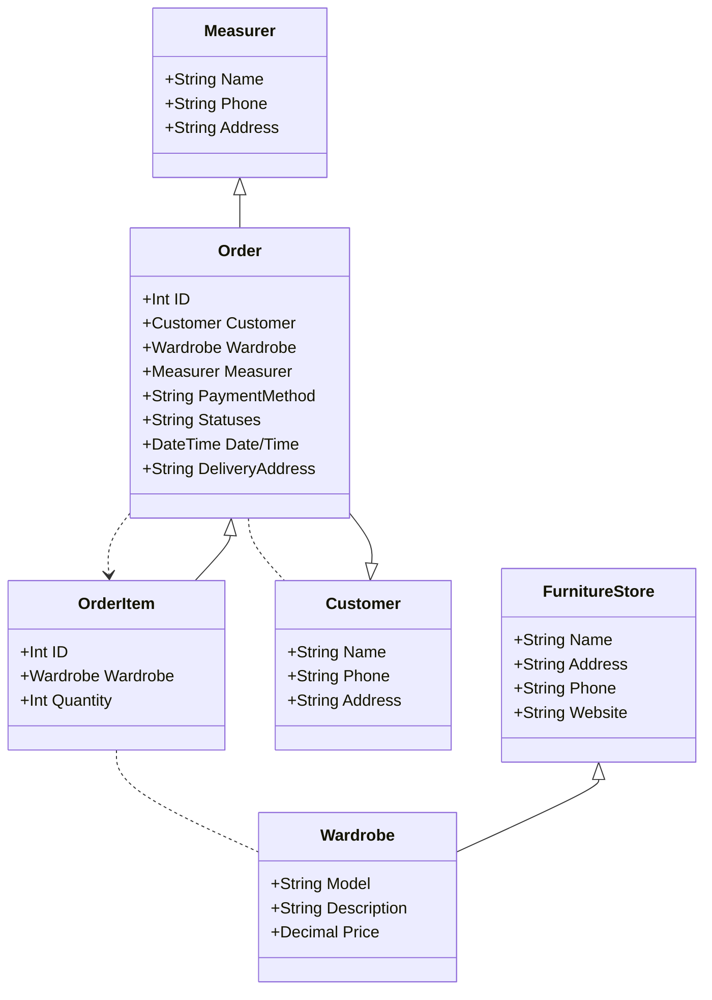

# UML - Заказ шкафа в квартиру с необходимостью вызова замерщика:

```mermaid
classDiagram
class FurnitureStore {
  +String Name
  +String Address
  +String Phone
  +String Website
}

class Wardrobe {
  +String Model
  +String Description
  +Decimal Price
}

class Measurer {
  +String Name
  +String Phone
  +String Address
}

class Customer {
  +String Name
  +String Phone
  +String Address
}

class Order {
  +Int ID
  +Customer Customer
  +Wardrobe Wardrobe
  +Measurer Measurer
  +String PaymentMethod
  +String Statuses
  +DateTime Date/Time
  +String DeliveryAddress
}

class OrderItem {
  +Int ID
  +Wardrobe Wardrobe
  +Int Quantity
}

OrderItem .. Wardrobe
Order .. Customer
Order ..> OrderItem
FurnitureStore <|-- Wardrobe
Customer <|-- Order
Order <|-- OrderItem
Measurer <|-- Order
```
