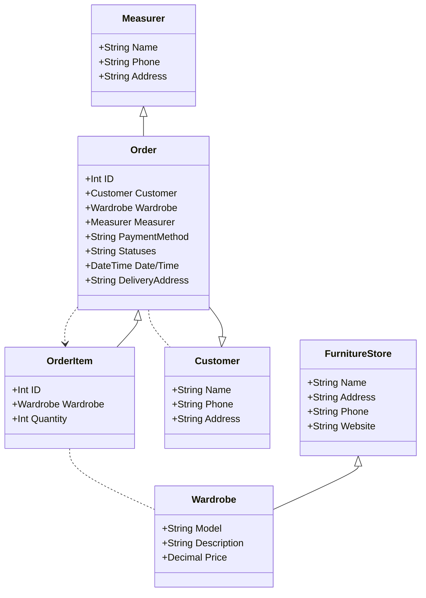
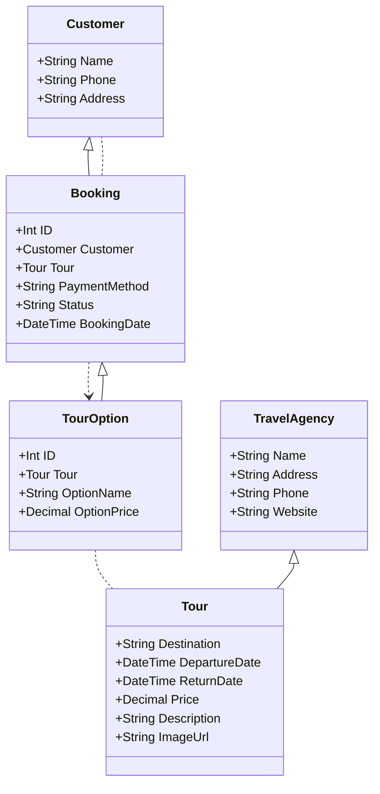
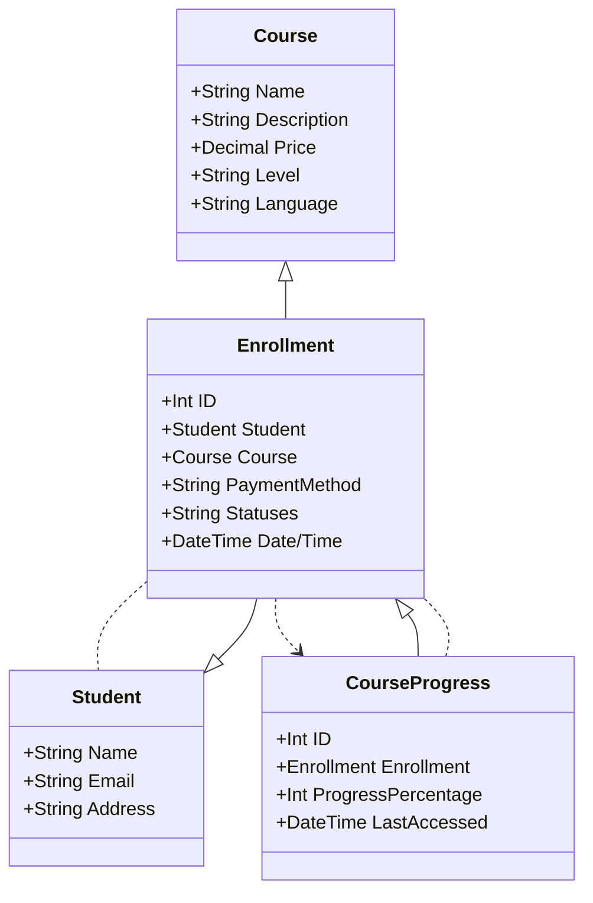
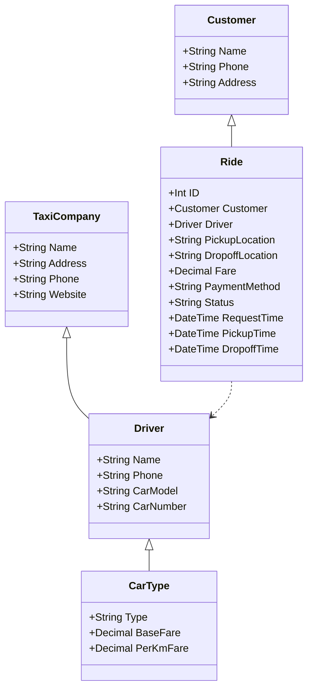

# UML - Заказ шкафа в квартиру с необходимостью вызова замерщика:

# UML - Покупка тура в турагенстве:

# UML - Заказ шкафа в квартиру с необходимостью вызова замерщика:

# UML - Прохождение онлай-курсов по программированию:

# UML - Заказ такси через мобильое приложение:

